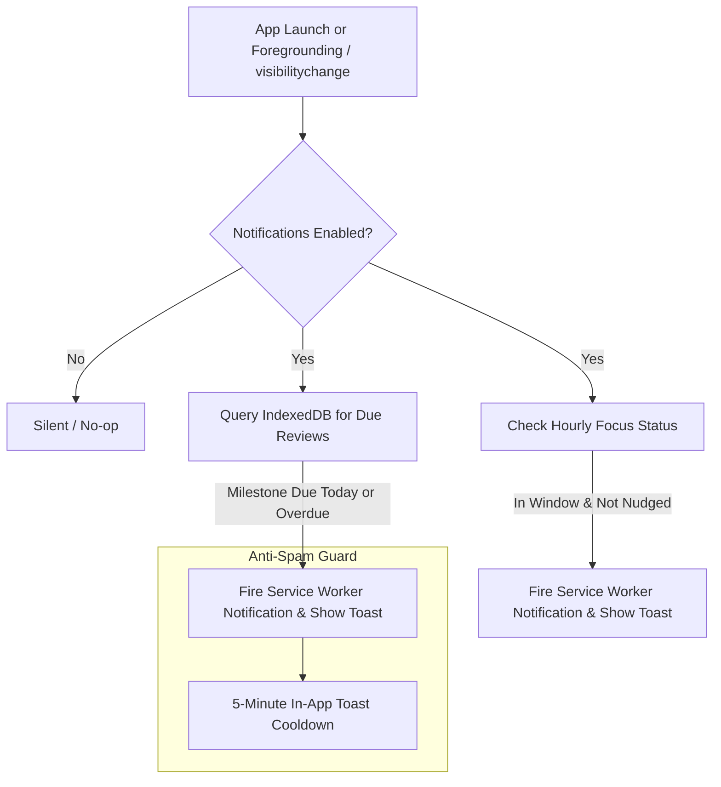

# Personal Study & Focus App — Complete Developer & Architecture Guide

Welcome to the **Personal Study & Focus App** codebase. This document is a comprehensive, self-contained architecture and technical reference designed so any developer or AI agent opening this repository cold can fully understand the system, its design decisions, data models, file responsibilities, and operational mechanics.

---

## 1. Executive Summary & Core Constraints

- **Platform Target:** Optimized specifically for iPhone PWA (Safari "Add to Home Screen" standalone mode) and modern mobile browsers.
- **Operating Cost:** Exactly $0 / Zero backend infrastructure.
- **Architecture:** 100% Client-side, offline-first Single Page Application (SPA).
  - Storage: IndexedDB (`studyapp-db` v2) for structured entities + `localStorage` for lightweight app state/preferences.
  - Offline Engine: Service Worker (`sw.js`) with cache-first shell caching.
- **Design Language:** Minimalist, Notion-inspired aesthetic.
  - Font: Inter (Google Fonts) with system fallbacks.
  - Palette: Calming off-white (`#F7F6F3`) in light mode, deep dark (`#111110`) in dark mode, and a signature Indigo/Lavender accent (`#5B6AF0`).
  - Tone: Clean whitespace, quiet borders (`#E3E2DE`), high scannability, zero noisy gamification, zero cartoonish badges.

---

## 2. File & Directory Structure

```
g:\IOS APP\
├── index.html          # Single-page app structure: Header, 4 tab panels, modals, toast, & install overlay
├── manifest.json       # PWA manifest (standalone display, portrait orientation, theme colors)
├── sw.js               # Service Worker: shell cache (v2), notification display & click routing
├── PROJECT_GUIDE.md    # Developer & architecture specification (this file)
├── css/
│   └── style.css       # Complete CSS: CSS variables, layout, typography, components, dark mode
├── js/
│   ├── db.js           # IndexedDB asynchronous promise wrapper (CRUD operations & migrations)
│   ├── syllabus.js     # Feature A: Syllabus Tracker (subject groups, chapters, retention, revisions)
│   ├── tasks.js        # Feature B: Timer-Lock To-Do List & full-screen lock screen mode
│   ├── reviews.js      # Feature C: Spaced-Repetition Study Reminders (+1d, +3d, +7d, +14d milestones)
│   ├── focus.js        # Feature D: Hourly Focus Reminders within configurable daytime window
│   └── app.js          # App bootstrap, tab switching, global notifications & iOS foreground checks
└── icons/
    ├── icon-192.png    # PWA launcher icon (192x192)
    └── icon-512.png    # PWA launcher icon (512x512)
```

---

## 3. Data Schemas & Storage Design

### A. IndexedDB Database: `studyapp-db` (Version 2)

Managed in [`js/db.js`](file:///g:/IOS%20APP/js/db.js). All database calls return native Promises.

#### 1. Store: `subjects`
Holds top-level syllabus subjects.
- `id` (integer, auto-increment primary key)
- `name` (string): Subject title (e.g. "Physics", "Organic Chemistry")
- `createdAt` (timestamp): Epoch timestamp in milliseconds

#### 2. Store: `chapters`
Holds individual syllabus chapters associated with a subject. Indexed by `subjectId`.
- `id` (integer, auto-increment primary key)
- `subjectId` (integer): Foreign key to `subjects.id`
- `chapterName` (string): Title of chapter or module
- `complete` (boolean): Whether fully mastered/completed
- `percentComplete` (integer, 0–100): Self-assessed syllabus progress
- `retention` (string): `"low"` | `"medium"` | `"high"`
- `revisionsDone` (integer, >= 0): Count of revision cycles completed
- `revisionsNeeded` (integer, >= 1): Target revision cycles
- `remarks` (string): User notes or weak areas

#### 3. Store: `tasks`
Holds to-do items for the timer-lock workflow.
- `id` (integer, auto-increment primary key)
- `title` (string): Name of task/focus session
- `estimatedMinutes` (integer): Planned duration (5–180 mins)
- `status` (string): `"todo"` | `"in-progress"` | `"completed"`
- `startedAt` (timestamp | null): Epoch timestamp when timer started
- `completedAt` (timestamp | null): Epoch timestamp when marked done

#### 4. Store: `reviews` (Feature C: Spaced Repetition)
Stores chapters logged for spaced repetition review cycles.
- `id` (integer, auto-increment primary key)
- `subject` (string): Name of subject (autocompleted from syllabus or custom)
- `chapterName` (string): Name of chapter studied
- `dateStudied` (string, `YYYY-MM-DD`): Base study date
- `milestones` (array of 4 objects):
  - `day` (integer): 1, 3, 7, or 14
  - `dueDate` (string, `YYYY-MM-DD`): Calculated as `dateStudied + day days`
  - `status` (string): `"pending"` | `"done"`
  - `reviewedAt` (string | null): Timestamp or date string when completed
  - `reviewNote` (string): Optional reflection note recorded during review
- `notes` (string): Optional notes captured at time of initial study

### B. LocalStorage Keys

- `studyapp_focus_settings`: Serialized JSON object for Feature D (Hourly Focus Reminder):
  ```json
  {
    "focusText": "Finish 20 physics problems",
    "startHour": 8,
    "durationHours": 12,
    "enabled": true,
    "snoozedUntil": 0,
    "turnedOffDate": null,
    "lastNudgeHour": 15
  }
  ```
- `studyapp_notifications_enabled`: `"true"` | `"false"`
- `studyapp_installed`: `"true"` (persisted once the user dismisses the install prompt)

---

## 4. Detailed Feature Implementations

### Feature A: Syllabus Tracker ([`js/syllabus.js`](file:///g:/IOS%20APP/js/syllabus.js))
- Grouped view by Subject with collapsible cards and overall progress meter.
- Inline chapter table featuring:
  - Completion checkbox.
  - Interactive slider for % progress (0-100%).
  - Retention indicator buttons: Low (red tint), Medium (amber tint), High (green tint).
  - Quick-action revision increment/decrement counters (`+` / `-`).
  - Search bar and smart filters ("Incomplete only", "Retention < Medium").

### Feature B: Timer-Lock To-Do List ([`js/tasks.js`](file:///g:/IOS%20APP/js/tasks.js))
- Tasks logged with an estimated duration in minutes.
- **Lock Screen Takeover:** When tapping "Start", the app engages a full-screen modal (`#lock-screen`).
  - Displays large ticking countdown timer, current task title, and clean distraction-free UI.
  - **Commitment Device:** Only two exit actions exist:
    1. "Mark Done" (saves completion time and marks task as completed).
    2. "Give Up" (requires confirmation dialog before returning to task list).
- Collapsible "Completed Tasks" accordion for reviewing past work.

### Feature C: Spaced-Repetition Study Reminders ([`js/reviews.js`](file:///g:/IOS%20APP/js/reviews.js))
- **Logging Flow:**
  - Input: Subject (with syllabus autocompletion datalist), Chapter name, Date studied (defaults to today), and optional notes.
  - On submission: Automatically calculates and schedules 4 milestones: **+1 day, +3 days, +7 days, +14 days**.
- **Display & Status Engine:**
  - Milestone chips indicate real-time status:
    - `done`: Milestone marked complete (green styling).
    - `duetoday`: Due date is today and not yet done (highlighted indigo outline).
    - `overdue`: Due date is before today and not yet done (amber/red warning).
    - `pending`: Future date (subtle neutral).
  - Tapping a milestone opens the **Review Completion Modal** (`#review-modal`), allowing the user to mark it done with optional reflection notes, or **Unmark / Reset** back to pending.
- **Filter Pills:**
  - "All"
  - "Due Today / Overdue" (with live count badge)
  - "Pending"
  - "Completed"
- **Notification Text Format:**
  `Review: [Subject] — [Chapter name] (Day X)`

### Feature D: Hourly Focus Reminders ([`js/focus.js`](file:///g:/IOS%20APP/js/focus.js))
- **Daily Focus Window:**
  - Main Focus text input (e.g., "Finish 20 physics problems").
  - Start Time selection: 6:00 AM through 2:00 PM (defaults to 8:00 AM).
  - Window Duration: 8 hours through 14 hours (defaults to 12 hours).
  - Dynamic display shows computed active window (e.g., `8:00 AM – 8:00 PM (12 hrs)`).
- **Controls & Actions:**
  - **Snooze 1 Hour:** Postpones nudges until `Date.now() + 60 * 60 * 1000`. Turns into a **"Cancel Snooze"** button when active.
  - **Turn Off Today:** Suppresses nudges until midnight of the current date. Turns into a **"Resume Today"** button when active.
  - **Send Test Nudge:** Allows immediate verification of notification dispatch and in-app toast rendering.
- **Hourly Engine:**
  - Checks every minute (`setInterval`) whether the current time falls inside the window, whether the current hour has already nudged, and respects snooze/turn-off flags.
- **Notification Text Format:**
  `Focus check: [main focus text]`

---

## 5. Notification Architecture & iOS Strategy

Because standard Web Push on iOS Safari has strict OS-level background execution limits without an external push notification server:



1. **Service Worker Push / Local Display:**
   - Where supported, uses `navigator.serviceWorker.ready.then(reg => reg.showNotification(title, options))`.
   - Falls back to `new Notification(title, options)` if SW notification registration is pending.
2. **In-App Toast Fallback:**
   - Displays a sleek slide-in notification toast (`#notification-toast`) directly inside the viewport.
   - Guarded by a 5-minute cooldown (`lastMilestoneToastTime`) to prevent annoying repetitions when users rapidly switch browser tabs.
3. **iOS Standalone Requirement Detection:**
   - If the user attempts to enable notifications in browser Safari on iOS, the app warns them that iOS requires adding the app to the Home Screen first (`navigator.standalone` or `display-mode: standalone`).

---

## 6. Service Worker & Caching Strategy ([`sw.js`](file:///g:/IOS%20APP/sw.js))

- **Cache Name:** `studyapp-shell-v2`
- **Asset Manifest:** Uses relative paths (`./`) to support both root and subpath deployments:
  - `./`
  - `./index.html`
  - `./css/style.css`
  - `./js/app.js`
  - `./js/db.js`
  - `./js/syllabus.js`
  - `./js/tasks.js`
  - `./js/reviews.js`
  - `./js/focus.js`
  - `./manifest.json`
  - `./icons/icon-192.png`
  - `./icons/icon-512.png`
- **Cache Policy:** Cache-first with network fallback for static shell assets.
- **Notification Clicks:** `notificationclick` event listener opens or focuses existing app client windows and closes the notification badge.

---

## 7. Running & Testing Locally

1. **Launch Server:**
   ```bash
   python -m http.server 8080
   ```
2. **Open in Browser:**
   Navigate to `http://localhost:8080/`.
3. **Verify Features:**
   - **Study Reviews:** Add a chapter in Reviews. Check that 4 milestones (+1, +3, +7, +14) appear. Click a milestone to complete with notes or unmark.
   - **Focus Reminders:** Enter a focus goal, adjust start hour and window, and click "Send Test Nudge". Test "Snooze 1 Hour" and "Turn Off Today" toggles.
   - **Timer-Lock:** Add a task, click "Start", verify full-screen lock countdown, and test "Mark Done" / "Give Up".
   - **Syllabus Tracker:** Create subjects and chapters, adjust retention and revision counters, test search filters.
   - **Notifications:** Click the bell icon in the header to request permissions and verify status badge.

---

## 8. Maintenance Guidelines for Future Developers / Agents

- **Zero Build Tools:** Do not introduce Webpack, Vite, or npm compilation steps unless explicitly requested. Everything must remain directly editable in standard browser JS/CSS.
- **CSS Modularity:** Keep all design tokens in `:root` inside [`css/style.css`](file:///g:/IOS%20APP/css/style.css). Never hardcode ad-hoc colors or inline styling.
- **Database Migrations:** If changing schema, increment `DB_VERSION` in [`js/db.js`](file:///g:/IOS%20APP/js/db.js) and add an upgrade handler inside `openDB(onupgradeneeded)`.
